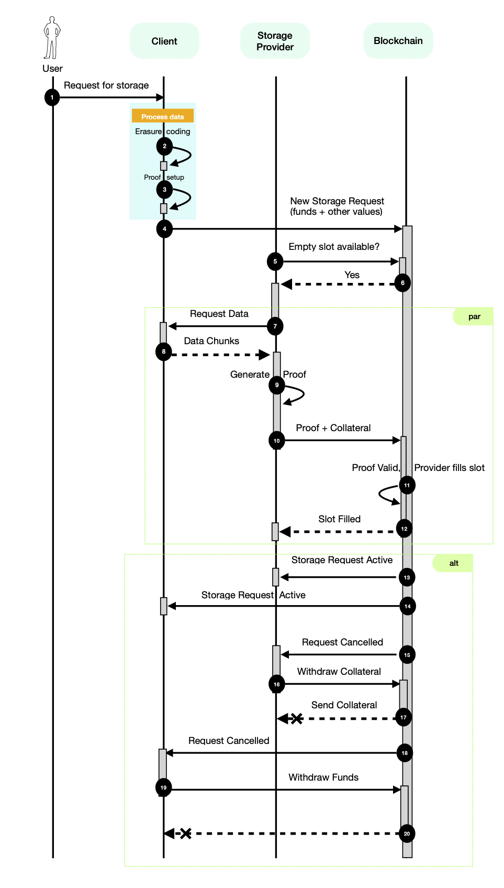

# Codex Marketplace Spec

title: CODEX-MARKETPLACE
name: Codex Storage Marketplace
status: raw
tags: codex
editor: Dmitriy <dryajov@status.im>
contributors:
- Mark <mark@codex.storage>
- Adam <adam@codex.storage>
- Eric <eric@codex.storage>
- Jimmy Debe <jimmy@status.im>
---

## Abstract

Codex Marketplace and its interactions are defined by a smart contract deployed on an EVM-compatible blockchain. This specification describes these interactions for the various roles within the network.

The document is intended for implementors of Codex nodes.

## Semantics 

The keywords “MUST”, “MUST NOT”, “REQUIRED”, “SHALL”, “SHALL NOT”, “SHOULD”, “SHOULD NOT”, “RECOMMENDED”, “MAY”, and “OPTIONAL” in this document are to be interpreted as described in [2119](https://www.ietf.org/rfc/rfc2119.txt).

### Definitions

| Terminology             | Description                                                                                                             |
| Terminology               | Description                                                                                                               |
|---------------------------|---------------------------------------------------------------------------------------------------------------------------|
| Storage Provider (SP)      | A node in the Codex network that provides storage services to the marketplace.                                             |
| Validator                  | A node that assists in identifying missing storage proofs.                                                                |
| Client                     | A node that interacts with other nodes in the Codex network to store, locate, and retrieve data.                           |
| Storage Request or Request | A request created by a client node to persist data on the Codex network.                                                  |
| Slot or Storage Slot       | A space allocated by the Storage Request to store a single chunk of the data related to this Storage Request.              |
| Smart Contract             | A smart contract associated with marketplace functionality.                                                               |
| Codex Tokens               | ERC20-based tokens used within the Codex network.                                                                          |

## Motivation

The Codex network aims to create a peer-to-peer storage engine with robust data durability, data persistence guarantees, and incentives for node storage.

The marketplace is a critical component of the Codex network, serving as a platform where all involved parties interact to ensure data persistence. It also provides mechanisms to enforce agreements and facilitate data repair when Storage Nodes fail to fulfill their duties.

Implemented as a Smart Contract on an EVM-compatible blockchain, the Marketplace enables various scenarios where nodes assume one or more roles to maintain a reliable persistence layer for users. This specification details these interactions.

The Marketplace contract manages Storage Requests, maintains the state of allocated Storage Slots, and orchestrates Storage Provider rewards, collaterals, and storage proofs.

A node that wishes to participate in the Codex persistence layer MUST implement one or more roles described in this document.

### Roles

A node can assume one of the three main roles in the network: the Client, the Storage Provider (SP), and the Validator (for the sake of conciseness and where it does not cause ambiguity, referred to as a Client, Storage Provider, and Validator, respectively).

A Client is a potentially short-lived node in the network with the purpose of persisting its data in the Codex persistence layer.

A Storage Provider is a long-lived node providing storage for Clients in exchange for profit. To ensure a reliable, robust service for Clients, Storage Providers are required to periodically provide evidence that they are persisting the data.

A Validator ensures that Storage Providers correctly fulfill their duties and provide proofs of storage when requested by the Smart Contract.

## Storage Request Lifecycle

The diagram below depicts the lifecycle of a Storage Request:

```
                      ┌───────────┐                               
                      │ Cancelled │                               
                      └───────────┘                               
                            ▲                                     
                            │ Not all                             
                            │ Slots filled                        
                            │                                     
    ┌───────────┐    ┌──────┴─────────────┐           ┌─────────┐ 
    │ Submitted ├───►│ Slots Being Filled ├──────────►│ Started │ 
    └───────────┘    └────────────────────┘ All Slots └────┬────┘ 
                                            Filled         │      
                                                           │      
                                   ┌───────────────────────┘      
                           Proving ▼                              
    ┌────────────────────────────────────────────────────────────┐
    │                                                            │
    │                 Proof submitted                            │
    │       ┌─────────────────────────► All good                 │
    │       │                                                    │
    │ Proof required                                             │
    │       │                                                    │
    │       │         Proof missed                               │
    │       └─────────────────────────► After some time slashed  │
    │                                   eventually Slot freed    │
    │                                                            │
    └────────┬─┬─────────────────────────────────────────────────┘
             │ │                                      ▲           
             │ │                                      │           
             │ │ SP kicked out and Slot freed ┌───────┴────────┐  
All good     │ ├─────────────────────────────►│ Repair process │  
Time ran out │ │                              └────────────────┘  
             │ │                                                  
             │ │ Too many Slots freed         ┌────────┐          
             │ └─────────────────────────────►│ Failed │          
             ▼                                └────────┘          
       ┌──────────┐                                               
       │ Finished │                                               
       └──────────┘                                               
```



## Client Role

A node implementing the Client role mediates the persistence of data within the Codex network.

A Client has two primary responsibilities:

- Requesting storage from the network by sending a Storage Request to the Smart Contract.
- Withdrawing funds from the Storage Requests previously created by the Client.

### Creating Storage Requests

When a user prompts the Client node to create a Storage Request, the Client node SHOULD receive the input parameters for the Storage Request from the user.

To create a request to persist a dataset on the Codex network, Client nodes MUST split the dataset into data chunks, $(c_1, c_2, c_3, \ldots, c_{n})$. Using the Erasure Coding method and the provided input parameters, the data chunks are encoded and distributed over a number of slots. The applied Erasure Coding method MUST use the [Reed-Soloman algorithm](https://hackmd.io/FB58eZQoTNm-dnhu0Y1XnA). The final slot roots and other metadata MUST be placed into a Manifest (TODO: Manifest RFC). The CID for the Manifest MUST then be used as the `cid` for the stored dataset.

> A more detailed introduction about the Manifest and the roots might be beneficial.

After the dataset is prepared, a Client node MUST call the Smart Contract function `requestStorage(request)`, providing the desired request parameters in the `request` parameter. The `request` parameter is of type `Request`:

```solidity
struct Request {
  // The Codex node requesting storage
  address client;

  // Describes parameters of Request
  Ask ask;
  
  // Describes the dataset that will be hosted with the Request
  Content content;

  // Timeout in seconds during which all the slots have to be filled, otherwise Request will get cancelled
  uint256 expiry;

  // Random value to differentiate from other requests of same parameters
  byte32 nonce;
}
  
struct Ask {
  // Amount of tokens that will be awarded to storage providers for finishing the storage request.
  // Reward is per slot per second.
  uint256 reward;

  // Amount of tokens required for collateral by storage providers
  uint256 collateral;

  // Frequency that storage providers need to submit proofs of storage
  uint256 proofProbability;

  // Total duration of the storage request in seconds
  uint256 duration;

  // The number of requested slots
  uint64 slots;

  // Amount of storage per slot in bytes
  uint256 slotSize;

  // Max slots that can be lost without data considered to be lost
  uint64 maxSlotLoss; 
}

struct Content {
  // Content identifier
  string cid;

  // Merkle root of the dataset, used to verify storage proofs
  byte32 merkleRoot;
}

```

The meaning of the Request parameters is given below:

> Note that not all parameters are defined. I think that in a formal spec we need to introduce all of them, even shortly.

`cid` 

An identifier used to locate the Manifest representing the dataset.
- MUST be a [CIDv1](https://github.com/multiformats/cid#cidv1), SHA-256 [multihash](https://github.com/multiformats/multihash).
- The data it represents SHOULD be discoverable in the network; otherwise, the Request MUST be canceled.

`reward`

- MUST be an amount of Codex Tokens offered per slot per second.
- The Ethereum address that submits the `requestStorage()` transaction MUST have [approval](https://docs.openzeppelin.com/contracts/2.x/api/token/erc20#IERC20-approve-address-uint256-) for the transfer of at least an equivalent amount in Codex Tokens.

> The second item could have a better explanation. E.g., it is not clear, who is the `approver`.

`collateral`

- The amount of tokens that Storage Providers submit when they fill slots.
- Collateral is then slashed or forfeited if Storage Providers fail to provide the service requested by the Request (more information below).

`proofProbability`

Determines the average frequency that a proof is required within a period: $\frac{1}{proofProbability}$

> Does it have a unit?

- Storage Providers are required to provide proofs of storage to the Marketplace Smart Contract when prompted by the Smart Contract.
- To prevent hosts from only coming online when proofs are required, the frequency at which proofs are requested from Storage Providers is stochastic and is influenced by the `proofProbability` parameter.

`expiry`

- The parameter is specified as a duration in seconds; therefore, the final deadline timestamp is calculated at the moment the transaction is mined.

`nonce`

- It SHOULD be a random byte array.

#### Renewal of Storage Requests

It should be noted that the Marketplace does not support extending Requests. It is REQUIRED that if the user wants to extend the duration of a Request, a new Request transaction with the same CID must be submitted **before the original Request completes**. This ensures that the data will continue to persist in the network at the time when the new (or existing) Storage Providers need to retrieve the complete dataset to fill the slots of the new Request.

### Withdrawing Funds

The Client node SHOULD monitor the status of the requests it created. When a Storage Request enters the `Cancelled` state (this occurs when not all slots have been filled after the `expiry` timeout), the Client node SHOULD initiate the withdrawal of the remaining funds from the Smart Contract using the `withdrawFunds(requestId)` function.

- The Request is considered `Cancelled` if no `RequestFulfilled(requestId)` event is observed during the timeout specified by the value returned from the `requestExpiresAt(requestId)` function.
- The Request is considered `Failed` when the `RequestFailed(requestId)` event is observed.
- The Request is considered `Finished` after the interval specified by the value returned from the `getRequestEnd(requestId)` function.

## Storage Provider Role

A Codex node acting as a Storage Provider persists data across the network by hosting slots requested by Clients in their Storage Requests.

The following tasks need to be considered when hosting a slot:

- Filling a slot
- Proving
- Repairing a slot
- Collecting Request reward and collateral

### Filling Slots

When a new Request is created, the `StorageRequested(requestId, ask, expiry)` event is emitted with the following properties:

- `requestId` - The ID of the Request.
- `ask` - The specification of the Request parameters. For details, see the definition of the `Request` type in the _Creating Storage Requests_ section above.
- `expiry` - A Unix timestamp specifying when the Request will be canceled if all slots are not filled by then.

It is then up to the Storage Provider node to decide, based on the parameters provided by the node operator, whether it wants to participate in the Request and attempt to fill its slot(s) (note that one Storage Provider can fill more than one slot). If the Storage Provider node decides to ignore the Request, no further action is required. However, if the Storage Provider decides to fill a slot, and succeeds, it MUST follow the remaining steps described below.

The node acting as a Storage Provider MUST decide which Slot, specified by the slot index, it wants to fill. The Storage Provider MAY attempt to fill more than one slot. To fill a slot, the Storage Provider MUST first download the slot data using the CID of the manifest (**TODO: Manifest RFC**) and the slot index. The CID is specified in `request.content.cid`, which can be retrieved from the smart contract using `getRequest(requestId)`. Then, the node MUST generate a proof over the downloaded data (**TODO: Proving RFC**).

When the proof is ready, the Storage Provider MUST call `fillSlot()` on the Smart Contract with the following parameters being REQUIRED:

- `requestId` - The ID of the Request.
- `slotIndex` - The slot index that the node wants to fill.
- `proof` - The `Groth16Proof` proof structure, generated over the slot data.
- The Ethereum address of the node from which the transaction originates MUST have [approval](https://docs.openzeppelin.com/contracts/2.x/api/token/erc20#IERC20-approve-address-uint256-) for the transfer of at least the amount of Codex Tokens required as collateral for the Request.

> Also here, the last point might benefit from a more detailed explanation.

If the proof delivered by the Storage Provider is invalid or the slot was already filled by another Storage Provider, then the transaction will be reverted. Otherwise, a `SlotFilled(requestId, slotIndex)` event is emitted. If the transaction is successful, the Storage Provider SHOULD transition into the __proving__ state, where it will need to submit proof of data possession when prompted by the Smart Contract.

It should be noted that if the Storage Provider node observes a `SlotFilled` event for the slot it is currently downloading the dataset for or generating the proof for, it means that the slot has been filled by another node in the meantime. In response, the Storage Provider SHOULD stop its current operation and attempt to fill a different, unfilled slot.

### Proving

Once a Storage Provider successfully fills a slot, it MUST periodically, though non-deterministically, provide proofs to the Smart Contract that it is storing the data it committed to store. A Storage Provider node SHOULD detect whether a proof is required using the `isProofRequired(slotId)` Smart Contract function, or anticipate that a proof will be required using `willProofBeRequired(slotId)` in case the node is in [downtime](https://github.com/codex-storage/codex-research/blob/41c4b4409d2092d0a5475aca0f28995034e58d14/design/storage-proof-timing.md).

> Including more details about _downtime_ might be beneficial.

Once the Storage Provider knows it must provide a proof, it MUST retrieve the proof challenge using `getChallenge(slotId)`, which then NEEDS to be incorporated into the proof generation as described in the Proving RFC (**TODO: Proving RFC**).

When the proof is generated, it MUST be submitted by calling the `submitProof(slotId, proof)` Smart Contract function.

#### Slashing

There is a slashing scheme orchestrated by the Smart Contract to incentivize correct behavior and proper proof submissions by Storage Providers. This scheme is configured at the Smart Contract level and applies uniformly to all participants in the network. The configuration of the slashing scheme can be obtained via the `getConfig()` contract call.

The slashing works as follows:

- A Storage Provider node MAY miss up to `config.collateral.slashCriterion` proofs before being slashed.
- It is then slashed by `config.collateral.slashPercentage` **of the originally required collateral** (the slashing amount is always consistent for a given request).
- If the number of slashes exceeds `config.collateral.maxNumberOfSlashes`, the slot is released, the remaining collateral is burned, and the slot is offered to other nodes for repair. The Smart Contract also emits the `SlotFreed(requestId, slotIndex)` event.

If, at any time, the number of released slots exceeds the value specified by the `request.ask.maxSlotLoss` parameter, the dataset is considered lost, and the Request is deemed _failed_. The collateral of all Storage Providers that hosted the slots associated with the Request is burned, and the `RequestFailed(requestId)` event is emitted.

### Repair

When a slot is released due to too many missed proofs, which SHOULD be detected by listening to the `SlotFreed(requestId, slotIndex)` event, a Storage Provider node can decide whether to participate in repairing the slot. Similar to filling a slot, the node SHOULD consider the operator's configuration when making this decision. The Storage Provider that originally hosted the slot but failed to comply with proving requirements MAY also participate in the repair. However, by refilling the slot, the Storage Provider **will not** recover its original collateral and must submit new collateral using the `fillSlot()` call.

The repair process is similar to filling slots. If the original slot dataset is no longer present in the network, the Storage Provider MAY use Erasure Coding to reconstruct the dataset. Reconstructing the original slot dataset requires retrieving other pieces of the dataset stored in other slots belonging to the Request. For this reason, the node that successfully repairs a slot is entitled to an additional reward. (**TODO: Implementation**)

The repair process proceeds as follows:

1. The Storage Provider observes the `SlotFreed` event and decides to repair the slot.
2. The Storage Provider MUST download the chunks of data required to reconstruct the released slot's data. The node MUST use the [Reed-Solomon algorithm](https://hackmd.io/FB58eZQoTNm-dnhu0Y1XnA) to reconstruct the missing data.
3. The Storage Provider MUST generate proof over the reconstructed data.
4. The Storage Provider MUST call the `fillSlot()` Smart Contract function with the same parameters and collateral allowance as described in the [Filling Slots](#filling-slot) section.

### Collecting Funds

A Storage Provider node SHOULD monitor the Requests and the associated slots it hosts.

When a Storage Request enters the `Cancelled`, `Finished`, or `Failed` state, the Storage Provider node SHOULD call the `freeSlot(slotId)` Smart Contract function.

The aforementioned Storage Request states (`Cancelled`, `Finished`, and `Failed`) can be detected as follows:

- A Storage Request is considered `Cancelled` if no `RequestFulfilled(requestId)` event is observed within the time indicated by the `expiry` Request parameter. Note that a `RequestCancelled` event may also be emitted, but the node SHOULD NOT rely on this event to assert the Request expiration, as the `RequestCancelled` event is not guaranteed to be emitted at the time of expiry.
- A Storage Request is considered `Finished` when the time indicated by the value returned from the `getRequestEnd(requestId)` function has elapsed.
- A node concludes that a Storage Request has `Failed` upon observing the `RequestFailed(requestId)` event.

For each of the states listed above, different funds are handled as follows:

- In the `Cancelled` state, the collateral is returned along with a proportional payout based on the time the node actually hosted the dataset before the expiry was reached.
- In the `Finished` state, the full reward for hosting the slot, along with the collateral, is collected.
- In the `Failed` state, no funds are collected. The reward is returned to the client, and the collateral is burned. The slot is removed from the list of slots and is no longer included in the list of slots returned by the `mySlots()` function.

## Validator Role

In a blockchain, it is impossible to act on events that **do not happen** since every action results from a transaction. Therefore, our Smart Contract requires an external trigger to periodically check and confirm that a storage proof has been delivered by the Storage Provider. This is where the Validator role is essential.

The Validator role is fulfilled by nodes that verify whether Storage Providers have submitted the required storage proofs. 

It is the Smart Contract that checks if the proof requested from a Storage Provider has been delivered. The Validator's job is to trigger this check on the Smart Contract for Storage Providers "observed" by the Validator. To incentivize Validators, they receive a reward each time they help identify a missing proof from a Storage Provider.

Each time a Validator observes the `SlotFilled` event, it adds the slot reported in the `SlotFilled` event to its list of watched slots. Then, at the end of each period, a Validator has up to `config.proofs.timeout` seconds (a configuration parameter retrievable with `getConfig()`) to request proof validation from the Smart Contract for each slot in its list. If a slot lacks the required proof, the Validator SHOULD call the `markProofAsMissing(slotId, period)` function on the Smart Contract. After confirming the missing proof for the slot with ID `slotId` in the given `period`, the `markProofAsMissing(slotId, period)` function will reward the Validator.

> It may be helpful to add an introduction or explanation regarding the periods and their occurrence.

If validating all the slots observed by the Validator is not feasible within the specified `timeout`, the Validator MAY choose to validate only a subset of the observed slots.

## Copyright

Copyright and related rights waived via [CC0](https://creativecommons.org/publicdomain/zero/1.0/).

## References 

1. [Reed-Soloman algorithm](https://hackmd.io/FB58eZQoTNm-dnhu0Y1XnA)
2. [CIDv1](https://github.com/multiformats/cid#cidv1)
3. [multihash](https://github.com/multiformats/multihash)
4. [Proof-of-Data-Possession](https://hackmd.io/2uRBltuIT7yX0CyczJevYg?view)
5. [Codex market implementation](https://github.com/codex-storage/nim-codex/blob/master/codex/market.nim)
