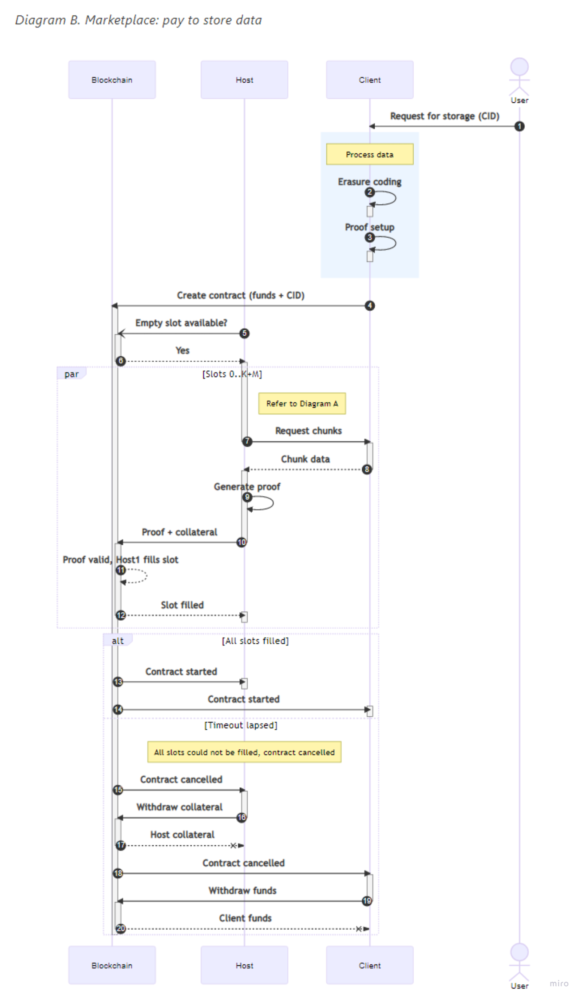

# Codex Marketplace Spec

---
title: CODEX-MARKETPLACE
name: Codex Storage Marketplace
status: raw
tags: codex
editor: Dmitriy <dryajov@status.im>
contributors:
- Mark <mark@codex.storage>
- Adam <adam.u@status.im>
- Eric <ericmastro@status.im>
- Jimmy Debe <jimmy@status.im>
---

## Abstract

Codex Marketplace and its interactions are defined by a smart contract deployed on an EVM-compatible blockchain. 
This specification describes these flows for all the different roles in the network. 
The specification is meant for a Codex client implementor.  

## Semantics 

The keywords “MUST”, “MUST NOT”, “REQUIRED”, “SHALL”, “SHALL NOT”, “SHOULD”, 
“SHOULD NOT”, “RECOMMENDED”, “MAY”, and “OPTIONAL” in this document are to be interpreted as described in [2119](https://www.ietf.org/rfc/rfc2119.txt).

### Definitions

| Terminology             | Description                                                                                                             |
|-------------------------|-------------------------------------------------------------------------------------------------------------------------|
| storage provider (SP) nodes | A node that provides storage services to the marketplace.                                                               |
| validator nodes         | A node that checks for missing storage proofs and triggers contract call for a reward.                                  |
| client nodes            | The most common node that interacts with other nodes to store, locate and retrieve data.                                |
| storage request         | Created by client node when it wants persist data on the network. Represents the dataset and persistence configuration. |
| slots                   | Storage request dataset is split into several pieces (slots) that are then distributed over different SPs.              |

## Motivation

The Codex network aims to create a peer-to-peer storage engine with strong data durability,
data persistence guarantees, and node storage incentives.

An important component of Codex network is a Marketplace. It is a place which mediates negotiations of all parties
in order to provide persistence in the network. It also provides ways to enforce agreements and **TODO** with repair.

Marketplace is defined by smart-contract that is deployed to EVM-compatible blockchain. It has several flows which are 
linked with roles in the network and which the participating node takes upon itself. It can be one role or multiple at the same time.
This specification describes these flows.

The Marketplace handles storage requests, the storage slot state,
storage provider rewards, storage provider collaterals, and storage proof state.

If a node implementation wants to participate in the persistence layer of Codex it needs to choose which role(s) it wants
to support and implement properer flows otherwise it won't be compatible with the rest of the Codex network.

### Roles

There are 3 main roles in the network - client, storage provider (SP) and validator. 

Client is a potentially short-lived node in the network, that interacts with it with the main purpose of persisting
its data in the network. 

Storage Provider is long-term participant in the network, that store other's data for profit. It needs to provide a proof
to the smart contract that it possesses the data from time to time.

Validator is a node that helps with enforcing the storage provider's duties to comply with storage requests that they 
accepted. When it detects that SP should have submitted a proof but non was submitted on-chain, it triggers on-chain 
function which will handle this case. Validator is rewarded for correct invocation of this function.

## Storage Request Lifecycle

```
                      ┌───────────┐                               
                      │ Cancelled │                               
                      └───────────┘                               
                            ▲                                     
                            │ Not all                             
                            │ Slots filled                        
                            │                                     
    ┌───────────┐    ┌──────┴─────────────┐           ┌─────────┐ 
    │ Submitted ├───►│ Slots Being Filled ├──────────►│ Started │ 
    └───────────┘    └────────────────────┘ All Slots └────┬────┘ 
                                            Filled         │      
                                                           │      
                                   ┌───────────────────────┘      
                           Proving ▼                              
    ┌────────────────────────────────────────────────────────────┐
    │                                                            │
    │                 Proof submitted                            │
    │       ┌─────────────────────────► All good                 │
    │       │                                                    │
    │ Proof required                                             │
    │       │                                                    │
    │       │         Proof missed                               │
    │       └─────────────────────────► After some time slashed  │
    │                                   eventually Slot freed    │
    │                                                            │
    └────────┬─┬─────────────────────────────────────────────────┘
             │ │                                      ▲           
             │ │                                      │           
             │ │ SP kicked out and Slot Freed ┌───────┴────────┐  
All good     │ ├─────────────────────────────►│ Repair process │  
Time ran out │ │                              └────────────────┘  
             │ │                                                  
             │ │ Too much Slots Freed         ┌────────┐          
             │ └─────────────────────────────►│ Failed │          
             ▼                                └────────┘          
       ┌──────────┐                                               
       │ Finished │                                               
       └──────────┘                                               
```



## Client role

Client role represent nodes that mediate persisting data inside Codex network. 

There are 2 parts for client role:

 - Requesting storage from the network - creating storage request.
 - Withdrawing funds from storage requests.

### Creating storage requests

When the client node is prompted by the user to create a storage request, 
it SHOULD receive the input parameters for the storage request from the user. 

To create a request to persist a dataset on the Codex network,
client nodes MUST split the dataset into data chunks, $(c_1, c_2, c_3, \ldots, c_{n})$.
Using an erasure coding technique and input parameters, the data chunks are encoded and placed into separate slots.
The erasure coding technique MUST be the [Reed-Soloman algorithm](https://hackmd.io/FB58eZQoTNm-dnhu0Y1XnA). 
The final slot's roots and other metadata MUST be placed into Manifest. Manifest's CID is then used as the `cid` of the
stored dataset.

After the dataset is prepared, it MUST submit a transaction with the desired request parameters which are represented
as `Request` object and its sub-objects. Bellow are described its properties:

```solidity
struct Request {
  // The Codex node requesting storage
  address client;

  // Ask describing parameters of Request
  Ask ask;
  
  // Content describing the dataset that will be hosted with the Request
  Content content;

  // Timeout in seconds during which all the slots have to be filled, otherwise Request will get cancelled
  uint256 expiry;

  // Random value to differentiate from other requests of same parameters
  byte32 nonce;
}
  
struct Ask {
  // Amount of token that will be awarded to storage providers for finishing the storage request.
  // Reward is per slot per second.
  uint256 reward;

  // Amount of tokens required for collateral by storage providers
  uint256 collateral;

  // Probability how often storage providers needs to submit proof of storage
  uint256 proofProbability;

  // Amount of desired time for storage request in seconds
  uint256 duration;

  // The number of requested slots
  uint64 slots;

  // Amount of storage per slot in bytes
  uint256 slotSize;

  // Max slots that can be lost without data considered to be lost
  uint64 maxSlotLoss; 
}

struct Content {
  // Content identifier
  string cid;

  // Merkle root of the dataset, used to verify storage proofs
  byte32 merkleRoot;
}

```

Notes about some of the parameters:

`cid` 

An identifier used to locate the Manifest representing the dataset.
- MUST be a [CIDv1](https://github.com/multiformats/cid#cidv1) with sha-256 based [multihash](https://github.com/multiformats/multihash).
- Data it represents SHOULD be discoverable in the network, otherwise Request will get cancelled. 

`reward`

- It is an REQUIRED amount to be included in the transaction for a storage request.
- It SHOULD be an amount of tokens offered per slot per second.
- The Client address MUST have [approval](https://docs.openzeppelin.com/contracts/2.x/api/token/erc20#IERC20-approve-address-uint256-) for transfer of at least the same amount on the ERC20 based token, that the network utilizes. 

`collateral`

- Amount of tokens that the storage providers MUST submit when they fill slots.
- Collateral is then slashed or forfeited if the storage providers fail to provide the service requested by the Request (more information bellow).

`proofProbability`

Determines the inverse probability that a proof is required in a period: $\frac{1}{proofProbability}$

- Storage providers are REQUIRED to provide proofs of storage to the marketplace smart contract when they are prompted to by the smart contract.
- The frequency is non-deterministic in order to prevent from pre-calculation attacks, but it is affected by this parameter.

`expiry`

- Parameter is specified as duration in seconds, hence the final deadline timestamp is calculated at the moment when the transaction is mined. 

`nonce`

- It SHOULD NOT be an empty byte array

#### Renewal of Storage Request

It should be noted that Marketplace does not support extending Requests. It is REQUIRED that if user wants to 
extend the Request's duration, somebody submits a new Request transaction with the same CID **well before the original
Request finishes**. In this way the data will be still persisted in the network at the time when new (or the current) storage providers 
can retrieve the dataset in order to fill slots of the new Request.

### Withdrawing funds

The client node SHOULD monitor the status of Requests that it created. The node can utilize on-chain state in order to
fetch the list of the active Requests linked to the client node's blockchain address using function `myRequests()`, that
returns array of `RequestId`s. This list is kept up to date by the smart contract itself.

When Request reaches states `Cancelled` (not all slots filled after `expiry` timeout) or `Failed` (too many slots gets freed and data is non-recoverable)
the client node SHOULD initiate withdrawal of the remaining funds from the contract using function `withdrawFunds(requestId)`.

 - `Cancelled` state MAY be detected using timeout specified from function `requestExpiresAt(requestId)` **and** not detecting emitted `RequestFulfilled(requestId)` event.
 - `Failed` state MAY be detected using `RequestFailed(requestId)` event emitted from the smart contract.
 - `Finished` state MAY be detected setting timeout specified from function `getRequestEnd(requestId)`.

## Storage Provider role

Storage Provider (SP) role represents nodes that persist data across the network by hosting Slots of Requests 
that Client nodes requested.

There are several parts to hosting a slot:

 - Filling a slot
 - Proving
 - Repairing slots
 - Collecting Request's reward and collateral

### Filling slot

When new Request is created `StorageRequested(requestId, ask, expiry)` event is emitted with following properties: 

 - `requestId` - ID of Request.
 - `ask` - Specification of Request parameters. For details see above.
 - `expiry` - Unix timestamp that specifies when the Request will be cancelled if all slots are not filled by then.

It is then up to the Storage Provider node to decide based on the emitted parameters if it wants to participate in the 
Request and try to fill its slot(s). This decision SHOULD be done based on parameters specified by the node operator.
If the node decide to ignore this Request, no action is need, otherwise the node HAVE TO follow the remaining steps.

Node MUST decide which Slot specified by slot's index it wants to try to fill in. Node MAY try filling multiple
slots. In order to fill a slot, node first MUST download the slot's data using slot's root that can be retrieved
from Manifest specified in `request.content.cid` (**TODO: Manifest RFC**). This object can be retrieved from the smart contract using `getRequest(requestId)`.
Then node MUST generate proof over the downloaded data (**TODO: Proving RFC**).

When proof is ready it then MUST create transaction for smart contract call `fillSlot()` with following REQUIRED:
 
 - Parameters:
   - `requestId` - ID of the Request.
   - `slotIndex` - Index that the node is trying to fill.
   - `proof` - `Groth16Proof` proof structure, generated over the dataset.
 - The Ethereum address of the node from which the transaction originates MUST have [approval](https://docs.openzeppelin.com/contracts/2.x/api/token/erc20#IERC20-approve-address-uint256-) for transfer of at least the amount required as collateral for the Request on the ERC20 based token, that the network utilizes.

If the proof is invalid, or slot was already filled by other node then the transaction
will revert, otherwise `SlotFilled(requestId, slotIndex)` event is emitted. If the transaction is successful then the
node SHOULD transition into __proving__ state as it will need to submit proof of data possession when prompted by the
contract.

It should be noted that if the node see the `SlotFilled` emitted for slot that he is downloading the dataset or 
generating proof for, then node SHOULD stop and choose different non-filled slot to try to fill.

### Proving

Once node fills a slot it MUST periodically, yet non-deterministically provide proof to the smart contract that it 
stores the data it should. Node MAY detect that proof is required using the `isProofRequired(slotId)` or that it will
be required using the `willProofBeRequired(slotId)` in case the node is in [downtime](https://github.com/codex-storage/codex-research/blob/41c4b4409d2092d0a5475aca0f28995034e58d14/design/storage-proof-timing.md).

Once node knows it has to provide a proof it MUST obtain the proof challenge using `getChallenge(slotId)` which then
NEEDS to be incorporated into the proof generation as described in Proving RFC (**TODO: Proving RFC**).

#### Slashing

There is a slashing scheme in place that is orchestrated by the smart contract to incentive correct behavior
and proper proof submissions by the storage provider nodes. This scheme is configured on smart contract level and is 
the same for all the participants in the network. The concrete values of this scheme can be obtained by `getConfig()` contract call.

The slashing works in the following way:

 - Node MAY miss at most `config.collateral.slashCriterion` proofs before it is slashed.
 - It is then slashed `config.collateral.slashPercentage` percentage **of the originally asked collateral**.
 - If the number of times the node was slashed reaches above `config.collateral.maxNumberOfSlashes`, then the slot is freed, the remaining of node's collateral is burned and the slot is offered to other nodes for repair. Contract also emits the `SlotFreed(requestId, slotIndex)` event.

If the number of concurrent freed slots reaches above the `request.ask.maxSlotLoss`, then the dataset is lost and the Request is failed. 
The collateral of all the nodes that hosted Request's slots is burned and the event `RequestFailed(requestId)` is emitted.

### Repair

When slot is freed because of too many missed proofs, which SHOULD be detected by listening on the `SlotFreed(requestId, slotIndex)` event, then
storage provider node can decide if it wants to participate in the repairing of the slot. The node SHOULD, similarly like with slot's filling,
consider the node's operator configuration when making the decision.

The repair process is the same as with the filling slots, with one difference that the node MUST use the erasure coding to 
reconstruct the original dataset. As this requires retrieving more data of the dataset from the network, the node that 
will successfully fill the repair node will be granted additional reward. (**TODO: Implementation**)

The repair process is then as follows:

1. Node detects `SlotFreed` event and decide to repair it.
1. Node MUST download the required chunks and MUST use the [Reed-Soloman algorithm](https://hackmd.io/FB58eZQoTNm-dnhu0Y1XnA) to reconstruct the original slot's data.
1. Node MUST generate proof over the reconstructed data.
1. Node MUST submit transaction with call to `fillSlot()` with the same parameters and collateral allowance as described in the [Filling slot](#filling-slot).

### Collecting funds

Storage Provider node SHOULD monitor Requests and slots it hosts. In case it needs to discover what slots it is hosting,
for example, because the node had to restart, then it SHOULD use the contract call `mySlots()`, which returns slots IDs
associated with the Ethereum address from which the contract call originates. This list is kept up to date by the smart contract itself.

When node slot's Requests reaches states `Cancelled`, `Finished` or `Failed` it SHOULD call the contract's `freeSlot(slotId)` function.
These states can be detected using:

 - `Cancelled` state MAY be detected by setting timeout using `expiry` **and** not detecting `RequestFulfilled(requestId)` event. There is also `RequestCancelled` event emitted, yet that is not guaranteed to be emitted at the time of expiry.
 - `Finished` state MAY be detected by setting timeout specified from function `getRequestEnd(requestId)`.
 - `Failed` state MAY be detected by listening to the `RequestFailed(requestId)` event emitted.

For each of these states, different funds are collected:

- For `Cancelled` the collateral is returned together with proportional payout based on time that the node actually hosted the dataset before expiry was reached.
- For `Finished` the full reward for hosting the slot together with collateral is gathered.
- For `Failed` no funds are collected as reward is returned to the client and collateral is burned, but this call removes the slot from the `mySlots()` tracking.

## Validator role

Validator role represents nodes that verify that the Storage Provider nodes submit proofs when they are required.

This is because in blockchain we cannot act on things that **do not happen** and somebody needs to create a transaction 
in order for the smart contract to act on it. The validator nodes get then rewarded for each time they correctly
mark proof as missing.

Validator nodes MUST observe the slot's space by listening on the `SlotFilled` event, which SHOULD prompt the validator
to add the slot to the watched slots. Then after the end of every period validator has at most `config.proofs.timeout` seconds
(config can be retrieved with `getConfig()`) to validate all the slots and if it finds a slot that missed its proof, then 
it SHOULD submit transaction with call to the function `markProofAsMissing(slotId, period)` that validates the correctness
and if right, will reward the validator with a reward.

## Copyright

Copyright and related rights waived via [CC0](https://creativecommons.org/publicdomain/zero/1.0/).

## References 

1. [Reed-Soloman algorithm](https://hackmd.io/FB58eZQoTNm-dnhu0Y1XnA)
2. [CIDv1](https://github.com/multiformats/cid#cidv1)
3. [multihash](https://github.com/multiformats/multihash)
4. [Proof-of-Data-Possession](https://hackmd.io/2uRBltuIT7yX0CyczJevYg?view)
5. [Codex market implementation](https://github.com/codex-storage/nim-codex/blob/master/codex/market.nim)
